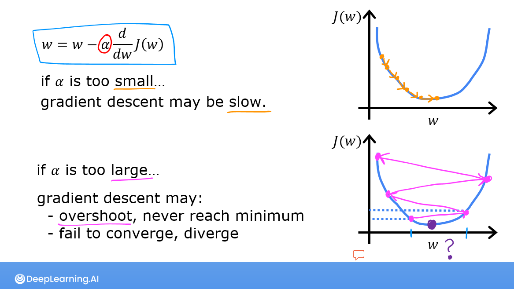
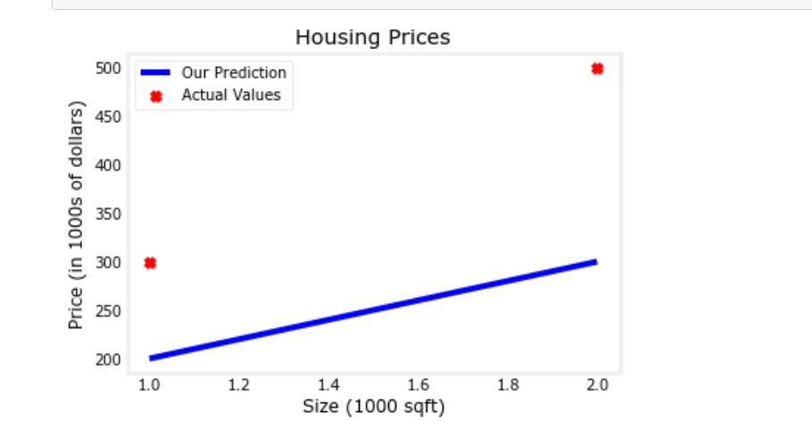
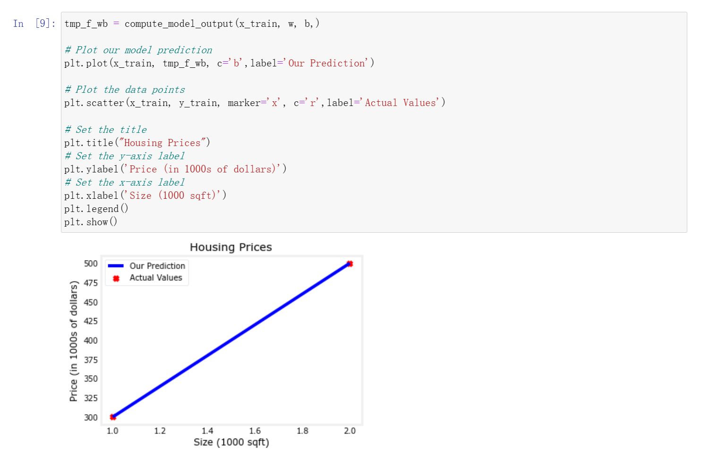
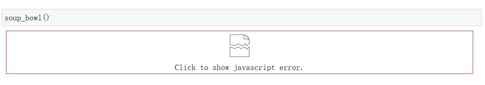
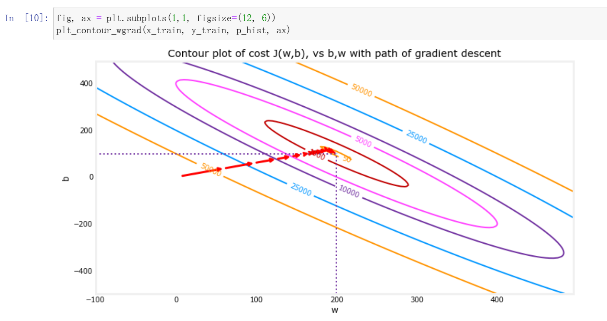
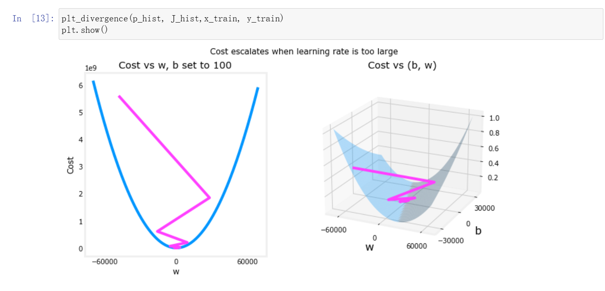

# 监督学习和无监督学习
## 监督学习
给定X Y使得模型学习后可以对给定的任意X得到对应的Y。 
监督学习可以分为两类：
- 预测问题。（X到Y的映射）例如预测房价，属于回归模型，可用直线或者曲线进行拟合。这类问题的预测可以是无穷多个数。  
- 预测类别。（二分类0，1），找到对应的分类边界。这类问题的预测是一些类型。 
## 无监督学习
数据与任何输出标签都不相关。没有数据标签,只有x没有y。也就是只有training set没有target。 
例如聚类算法clustering： 将无标签数据分成两类或多类。 
# 线性回归模型
在课程里最开始引入的例子是用房子的size预测房子的price。我们将横坐标作为房子的size，纵坐标作为房子的price，这样就可以将点描绘在坐标系上。现在要做的事就是找一条直线，让这条直线最fit图上的data，用这条直线来根据size计算estimated price，课程里用“y-hat”来表示。  
 
简单的线性回归可以定义为：f(x)=wx+b，这是一个包含两个parameter，也就是w和b的关于x的函数。接下来为了让这条直线与data的fit效果最好，我们需要找到适合的w和b来达到这个目的。这里需要引入一个评估fit程度的新概念-代价函数（cost function）。 
## 代价函数
f(x)=wx+b，w和b是两个可学习的parameter，为了衡量w,b对于真实值的匹配程度，采用代价函数来计算模型预测的y与真实值之间的差异。 
在线性回归中，常见的代价函数是平方误差代价函数(square error function)。它的定义如下图左边所示: 
  
图中的m表示training set中的样本数量，y-hat表示预测的价格。 
从图中可以看出，代价函数J是w和b的函数，我们要做的事就是找到使J最小的w和b，这样的w和b就可以让平方误差函数最下，使得线性回归的直线与data的fit效果达到最佳。 
为了找到我们需要的w和b，这里引入了一个新的概念-梯度（gradient descent）。 
## 梯度下降
我们按照下图右边所示定义梯度： 
  
其中α是learning rate，定义为一个正数，不能太大也不能太小（原因后面会讲到）。图中的右半部分中每次对w的更新都定义为w减去α乘以J对w的导数，其中J对w的导数也就是这里的梯度。对b的更新也类似。这里要注意一个重要的地方，对w和b的更新应该是同时计算的，而不是先更新w再更新b或者反过来先更新b再更新w。  
  
代价函数J，为了简单理解，课程里把b设置为0。如图的右半部分所示，现在J是一个关于w的函数，可以证明当图上的点不在最低点时，当更新w的值时，点总是向最低点靠近。这样每一次更新w我们都向J的最低点考进，以此来接近我们的目标-找到适当的w，使得J的值最小。当w=1时，我们到达了最低点，这时由于J对w的导数为0，所以w的值更新后还是w，这时的w就是我们想要的。  
  
接着解释以下为什么α不能太小或者太大的原因。如果α太小，这会让我们每次更新w时，在函数J上点移动的距离，或者说是跨出的步伐非常短，虽然能到达最低点，但是效率太低了；如果α太大，可能会使得我们在函数J上点移动的距离太大，反而错过了最低点。 
# 实验
本届课程中共有四个optional lab，其中第一个只是简单的输出字符串，所以我只做了后面的三个实验。本次实验在吴恩达老师的couresa上有写好的ipynb文件，但是对我来说访问还是不太方便，我找到了一个整理了所有实验的项目，可以直接在jupyter notebook中打开文件，这是项目的链接[参考的项目](https://github.com/kaieye/2022-Machine-Learning-Specialization)。由于实验已经提供了所有的代码，所以我只将我认为对我价值比较高的内容展示，同时也有一些遇到的问题。
## 线性回归展示
课程里一开始用的w和b均为100，所以不能很好地fit图上的data，我将w修改为200，b依然是100，得到的曲线能更好地fit图上的data。本次实验比较简单，因为图上一共就两个点，所以只是简单的计算就可以得到效果最好的拟合直线。 
  
  
## 代价函数
在这个实验里，我遇到了一个还没有解决的问题。 
  
本来这个实验是来展示代价函数J的，这个实验里的代价函数J是w和b的函数，所以这是一个二元的函数，画出来也是一个曲面，可以在jupyter输出的图中旋转来查看函数J不同的值。我一开始想的是暂时解决不了这个问题，可以试着修改一下代码，但是由于之前接触python比较少，对numpy和matplotlib这样的工具不太熟悉，所以修改后报错太多达不到效果。下一周我打算先学一下python然后把常见的工具的用法搞清楚，试着解决这个问题。 
## 梯度下降
本次实验虽然名为梯度下降，但它实际上是之前学到知识的总结实验。 
 
图中的左半边展示了代价函数J，这里将b设置为100，所以J是关于w的函数。课程给出了一个重要的结论，像线性回归模型这样的“bowl shape”形式的代价函数，只有一个最低点，不会有多个局部最低点。所以在对w和b的更新过程中，对于曲面函数J上的任何一点，从该店出发每移动一次都是向最低点靠近的过程。图中的右半边则是展示了w和b两个参数的梯度，也就是J分别对w和b求导得到的值。箭头的大小代表了此处梯度的大小，箭头的方向代表梯度的正负。向右上方向的箭头代表梯度为正，向左下方向的箭头代表梯度为负。 
 
在迭代计算的过程中，可以看到我们的迭代计算是有效的，因为如图所示cost一直是呈下降趋势。
  
本次实验中学到了一个重要的方法，就是用等高线的思想来绘制代价函数J。由于J在图上表现出三维的曲面性质，所以为了方便研究，我们可以假设我们站在这张曲面的竖直高点，就像在天空俯瞰一座山一样。我们绘制等高线时，将所有海拔相同的点连线，就可以得到一个又一个不规则的圈，因为山是一个凸起来的结构，所以最中心的圈代表的海拔最高，向外的圈依次降低海拔。用这样的方法来看函数J，我们也可以得到一个个椭圆形的圈，但是由于函数J是一个“bowl shape”的结构，所以最内圈表示的是最低的那一部分曲面，向外的圈函数J的值依次增加。所以我们在更新w和b的过程中，是从外往里走的，这样才能找到J的最低点。
  
在这张图的左半部分中，我们可以看到w在更新几次后，很快就到达了最低点。这时因为我们选取了比较合适的α。在图的右半部分，可以看到我们完整的找到最低点的过程。一定要保证w和b是同时更新的。

